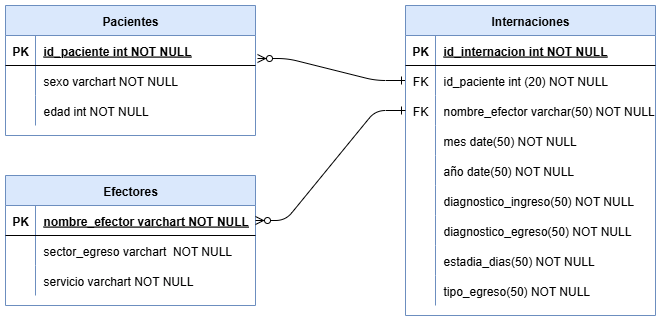

# 🏥 Dashboard de Internaciones Hospitalarias

Este repositorio contiene el análisis, limpieza y visualización de datos de internaciones hospitalarias de la ciudad de Rosario. Incluye:

- 📊 Datos en formato CSV
- 🧼 Notebook de limpieza (`01-Cleaning.ipynb`)
- 📈 Dashboard en Looker Studio
- 📄 Informe en Canva

## 📁 Estructura
- `Datos/`: archivos CSV originales
- `Notebook/`: notebook de limpieza y transformación
- `requirements.txt`: dependencias del entorno

## Fuente de Datos
[Datos Abiertos del Gobierno de Rosario](https://datosabiertos.rosario.gob.ar/dataset/27269926-7069-42ee-b520-110067dae003)

##  Diagrama Entidad-Relación
Este diagrama representa la estructura relacional del modelo de datos para el análisis de internaciones hospitalarias en Rosario. Se compone de tres entidades principales:

- **Pacientes**: contiene datos demográficos como sexo y edad, con un identificador único por paciente.
- **Internaciones**: tabla de hechos que registra cada episodio clínico, incluyendo diagnóstico de ingreso/egreso, duración y tipo de egreso.
- **Efectores**: representa los centros de atención, con atributos como nombre, sector de egreso y servicio de internación.

## 🔗 Acceso al dashboard
[Ver dashboard en Looker Studio](https://lookerstudio.google.com/reporting/a90f50d9-86f6-4a44-b750-e2023417003e)

## 🔗 Acceso al Informe
[Ver informe en Canva](https://www.canva.com/design/DAGxwJ3q_NA/4kY19B6qsx0UskecVrjqtQ/edit?utm_content=DAGxwJ3q_NA&utm_campaign=designshare&utm_medium=link2&utm_source=sharebutton)

## 📊 Insights destacados

- El diagnóstico más frecuente en los tres años de análisis fue Anomalía dinámica del trabajo de parto, con mayor prevalencia en pacientes entre 19-29 años.
- El efector con mayor carga asistencial fue el Hospital Infantil “Dr. Víctor J. Vilela , concentrando el 35% de las internaciones.
- La duración promedio de internación fue de 3.32 días, con variaciones según servicio y tipo de egreso.

##  Autora
Ruth Cruz